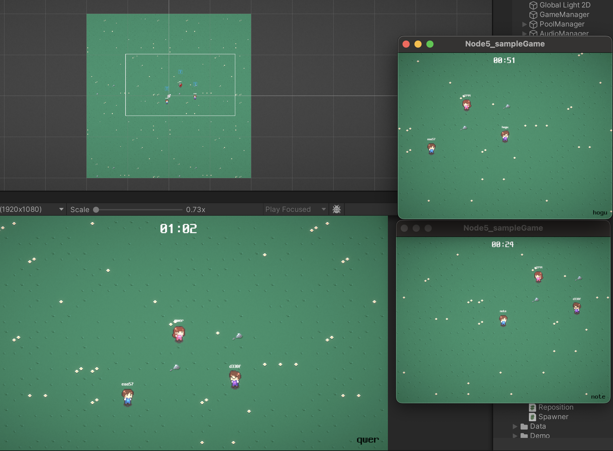

# [ Chapter 5 ] 멀티 플레이 과제



## 필수 과제

- [x] 프로젝트의 구성
- [x] 게임 인스턴스 생성
- [x] 유저 접속 처리

## 도전 과제

- [x] DB 연동 (마지막 위치 저장 및 전송)
- [x] Latency를 이용한 추측항법
- [ ] 테스트 클라이언트 개발

## 트러블 슈팅 [(링크)](https://velog.io/@vamuzz/TIL-%EB%82%B4%EC%9D%BC%EB%B0%B0%EC%9B%80%EC%BA%A0%ED%94%84-24.10.31-%EB%AA%A9)

- 유저 중복 스폰 문제 [ ✅ ]
  - 게임 세션 내 유저 정보 전달 시, 본인 제외하는 방식으로 해결
- AWS RDS 프리티어로 생성해서 사용해도 과금되는 문제 [ ✅ ] : [(링크)](https://velog.io/@vamuzz/AWS-RDS-%ED%94%84%EB%A6%AC%ED%8B%B0%EC%96%B4-%EA%B3%BC%EA%B8%88)
- 테스트 클라이언트로 접속 및 종료 시 일부 클라이언트가 종료안되는 문제 [ 😂 ]
- AWS EC2 접속이 안되던 문제.. [ 😂 ]
  - EC2인스턴스 재부팅 및 컴퓨터 재시동하니까 해결은 됨..[ 😂 ]
- pm2로 서버 실행 중 과부하(?) 시 pm2 명령어가 반응이 없는 문제.. [ 😂 ]

## 프로젝트 파일 구조

```
📁 Root
├── README.md
├── client.js                                          // 테스트 클라이언트
├── package-lock.json
├── package.json
└── 📁 src                                             // 서버
    ├── 📁 classes                                     // 매니저 클래스 모음
    │   ├── 📁 managers                                // 매니저 모음
    │   │   ├── base.manager.js                        // 베이스 매니저(부모)
    │   │   └── interval.manager.js                    // 인터벌 매니저
    │   └── 📁 models                                  // 모델 클래스 모음
    │       ├── game.class.js                          // 게임 클래스
    │       └── user.class.js                          // 유저 클래스
    ├── 📁 config
    │   └── config.js                                  // 설정 파일
    ├── 📁 constants                                   // 전역 관련
    │   ├── env.js                                     // .env 파일 관리
    │   ├── handlerIds.js                              // 핸들러 ID 모음
    │   └── header.js                                  // 헤더 모음 (길이,패킷타입 등)
    ├── 📁 db
    │   ├── database.js
    │   ├── 📁 migration                               // 마이그레이션
    │   │   └── createSchemas.js                       // 쿼리 실행 설정
    │   ├── 📁 sql
    │   │   └── user_db.sql                            // User 데이터베이스 테이블 생성 쿼리 (DDL)
    │   └── 📁 user
    │       ├── user.db.js                             // User 데이터베이스 쿼리 함수
    │       └── user.queries.js                        // User 데이터베이스 쿼리 모음 (DML)
    ├── 📁 events                                      // TCP 이벤트 모음
    │   ├── onConnection.js                            // on connection 이벤트
    │   ├── onData.js                                  // on data 이벤트
    │   ├── onEnd.js                                   // on end 이벤트
    │   └── onError.js                                 // on error 이벤트
    ├── 📁 handlers                                    // 핸들러 모음
    │   ├── 📁 game                                    // 게임 핸들러
    │   │   └── locationUpdate.handler.js              // 위치동기화 핸들러
    │   ├── index.js                                   // 핸들러 매핑용
    │   └── 📁 user                                    // 유저 핸들러
    │       └── initial.handler.js                     // 유저 최초 연결 핸들러
    ├── 📁 init                                        // 서버 시작 시 기능 모음
    │   ├── createGameSession.js                       // 게임 세션 생성
    │   ├── index.js                                   // 서버 시작 시 기능 호출
    │   └── loadProtos.js                              // 프로토버퍼 파일 읽어오기
    ├── 📁 protobuf                                    // 프로토버퍼 파일 모음
    │   ├── 📁 notification                            // 알림용 프로토버퍼 모음
    │   │   └── game.notification.proto                // 게임 알림용 프로토버퍼(위치동기화)
    │   ├── packNames.js                               // 프로토버퍼 이름 파일
    │   ├── 📁 request                                 // 요청용 프로토버퍼 모음
    │   │   ├── common.proto                           // 공용 프로토버퍼 (공통패킷,핑)
    │   │   └── game.proto                             // 게임 프로토버퍼 (위치동기화)
    │   │   └── initial.proto                          // 접속 프로토버퍼
    │   └── 📁 response                                // 응답용 프로토버퍼 모음
    │       └── response.proto                         // 응답 프로토버퍼
    ├── server.js                                      // 서버 실행 코드
    ├── 📁 session                                     // 세션 모음
    │   ├── game.session.js                            // 게임 세션 (게임세션추가,삭제,정보조회)
    │   ├── sessions.js                                // 세션 저장소
    │   └── user.session.js                            // 유저 세션 (유저추가,삭제,다음시퀀스,조회)
    └── 📁 utils                                       // 유틸 모음
        ├── dateFormatter.js                           // 날짜 포맷 변경 유틸
        ├── 📁 db                                      // DB 관련 유틸
        │   └── testConnection.js                      // 테스트 연결용
        ├── 📁 error                                   // 에러 관련 유틸
        │   ├── customError.js                         // 커스텀 에러
        │   ├── errorCodes.js                          // 에러코드 모음
        │   └── errorHandler.js                        // 에러핸들러
        ├── 📁 notification                            // 알림 유틸
        │   └── game.notification.js                   // 게임 알림 유틸(패킷 생성)
        ├── 📁 parser                                  // 파싱 유틸
        │   └── packetParser.js                        // 프로토버퍼 디코딩 유틸
        ├── 📁 response                                // 응답
        │   └── createResponse.js                      // 응답 패킷 생성
        └── transformCase.js                           // 스네이크케이스 카멜케이스로 변환 유틸
```
